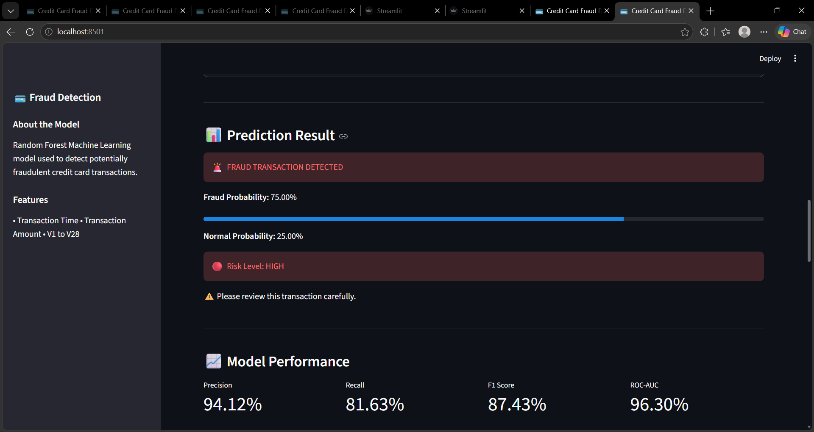

# 💳 Credit Card Fraud Detection

A Machine Learning based web application that detects potentially fraudulent credit card transactions using a Random Forest Classifier and Streamlit.

## 🚀 Features

- Credit card transaction fraud detection
- Random Forest Machine Learning model
- Fraud probability prediction
- Normal probability prediction
- Low / Medium / High risk classification
- Confusion Matrix
- ROC Curve
- Feature Importance
- Model performance metrics
- Prediction history
- Interactive Streamlit web interface

## 🛠️ Technologies Used

- Python
- Pandas
- Scikit-learn
- Matplotlib
- Joblib
- Streamlit

## 🤖 Machine Learning Model

The project uses a Random Forest Classifier trained using:

- Time
- Amount
- V1–V28 anonymized transaction features

## 📊 Model Performance

| Metric | Score |
|---|---:|
| Precision | 94.12% |
| Recall | 81.63% |
| F1 Score | 87.43% |
| ROC-AUC | 96.30% |
| PR-AUC | 87.34% |

## 📁 Project Structure

```text
Credit_Card_Fraud_Detection/
│
├── app.py
├── fraud_model.pkl
│
├── data/
│   └── creditcard.csv
│
├── notebook/
│   ├── fraud_analysis.py
│   └── test_model.py
│
├── confusion_matrix.png
├── roc_curve.png
├── feature_importance.png
│
└── README.md